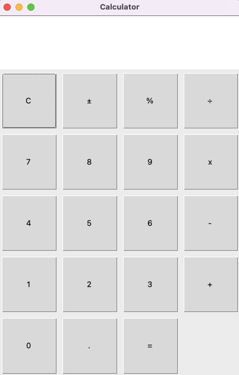

# 🧮 Python Tkinter Calculator

A simple calculator GUI built with Python's `tkinter` and `ttk` libraries. It supports basic arithmetic operations along with percentage and sign toggle functionality.

## Features

- ➕ Basic operations: addition, subtraction, multiplication, and division
- 🟰 Evaluate expressions using `=`
- ♻️ Clear button (`C`)
- 🔁 Toggle positive/negative with `±`
- 📉 Percentage calculation with `%`
- 🔢 Responsive grid layout
- ⌨️ Keyboard bindings for:
  - `Enter` → Evaluate (`=`)
  - `Backspace` → Clear (`C`)

## 🖥️ UI Preview

## 📦 Requirements

- Python 3.x
- `tkinter` (comes pre-installed with most Python distributions)

## Clone the repository

git clone git@github.com:Nas1010/python-calculator.git
cd python-calculator

## Run the calculator

python3 main.py